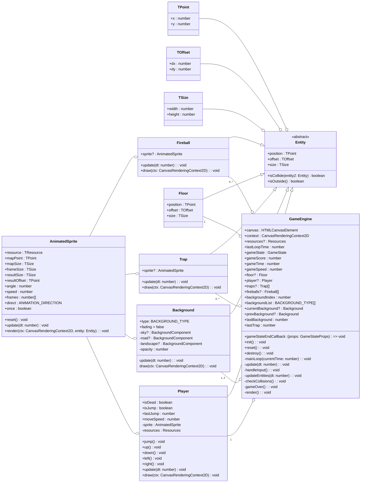
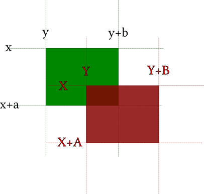

# Игровой движок <!-- omit in toc -->

- [UML диаграмма общих взаимосвязей](#uml-диаграмма-общих-взаимосвязей)
- [Базовые классы](#базовые-классы)
  - [GameEngine](#game-engine)
  - [Entity](#entity)
  - [Calculations](#calculations)
  - [AnimatedSprite](#animated-sprite)
- [Классы игровых объектов](#классы-игровых-объектов)
  - [Player](#player)
  - [Floor](#floor)
  - [Trap](#trap)
  - [Fireball](#fireball)
  - [Background](#background)
- [Вспомогательные классы](#вспомогательные-классы)
  - [KeyControls](#key-controls)
  - [Resources](#resource)

## UML диаграмма общих взаимосвязей



## Базовые классы

### GameEngine

Основной класс, здесь запускается игровой цикл, здесь запускается инициализация всех игровых объектов. А также содержатся вспомогательные методы по работе с различной логикой игры.

Аргументы конструктора

|        Имя        | Описание                                                |
| :---------------: | :------------------------------------------------------ |
|      **canvas**      | 2D контекст на котором будет рисоваться игра            |
|     **disableResources**     | флаг для отключения использования ресурсов (для тестирования) |
|  **gameStateEndCallback**   | callback вызываемый при окончании игры                  |

Пример инициализации и запуска игрового движка

```javascript
const gameEngine = new GameEngine({
  /* Опции */
});
```

1. Создается instance игрового движка с указанными опциями
2. Вызывается метод для загрузки ресурсов, который по завершению вызывает callback-метод `init()` для инициализации игрового движка и старта игрового процесса, при этом все игровые объекты будут созданы автоматически. Если включена опция `disableResources = true` метод `init()` вызывается напрямую, в обход загрузки ресурсов (запускается игра без визуального оформления).
3. В методе `init()` запускается цикл игры `mainLoop()`, мы обновляем и отображаем сцену, и затем используем requestAnimationFrame для постановки в очередь следующего цикла.

```javascript
  private mainLoop = (currentTime = 0): void => {
    const deltaTime = currentTime - this.lastLoopTime
    const minDeltaTime = 1000 / GAME_OPTIONS.GAME_MIN_FPS

    // если с предыдущего кадра прошло слишком много времени
    // то обновление и отрисовка не производится (например, браузер был НЕ активен)
    if (deltaTime < minDeltaTime) {
      this.update(deltaTime / 1000)
      this.render()
    }

    this.lastLoopTime = currentTime
    window.requestAnimationFrame(this.mainLoop)
  }
```

Параметр в dt в функции update — это разница между текущим временем и временем последнего обновления. Никогда не обновляйте сцену используя постоянное значение для кадра (в духе, x += 5).
Игра будет будет работать на разных компьютерах/платформах по-разному, по этому необходимо обновлять сцену независимо от частоты кадров.
Это достигается путём расчет времени с последнего обновления и выражения всех перемещений в пикселях в секунду, движение становится следующим x += 50*dt, или 50 пикселей в секунду.

### Entity

Абстрактный класс игрового объекта, содержит интерфейс необходимый для оперирования объектами в `GameEngine`

Аргументы конструктора тип `TEntityProps`:

|     Имя      | Описание                                                                                                                                                                                     |
| :----------: | :------------------------------------------------------------------------------------------------------------------------------------------------------------------------------------------- |
|   **position**    | координаты верхнего левого угла описывающего прямоугольника |
|  **offset**   | скорость движения по оси `x` и `y`  |
| **size** | ширина и высота описывающего прямоугольника |

Доступные методы для использования в классах наследниках:

|    Имя     | Описание                                                                                                                                                                                             |
| :--------: | :--------------------------------------------------------------------------------------------------------------------------------------------------------------------------------------------------- |
|  **isCollide**  | проверка пересечения с другой сущностью entity2 |
| **isOutside** | проверить находится сущность за сценой |

### Calculations

Вспомогательный класс для выполнения игровых расчетов

Тип `TPoint`:
|     Имя      | Описание                                                                                                                                                                                     |
| :----------: | :------------------------------------------------------------------------------------------------------------------------------------------------------------------------------------------- |
|   **x**    | координата по оси X |
|  **y**   | координата по оси Y  |

Тип `TSize`:
|     Имя      | Описание                                                                                                                                                                                     |
| :----------: | :------------------------------------------------------------------------------------------------------------------------------------------------------------------------------------------- |
|   **width**    | ширина описывающего прямоугольника |
|  **height**   | высота описывающего прямоугольника |

Тип `TOffset`:
|     Имя      | Описание                                                                                                                                                                                     |
| :----------: | :------------------------------------------------------------------------------------------------------------------------------------------------------------------------------------------- |
|   **dx**    | смещение по оси X |
|  **dy**   | смещение по оси Y  |

Метод `boxCollides` проверяет пересекаются ли между собой два прямоугольника

```js
/* ... */
function collides(x: number, y: number, r: number, b: number, x2: number, y2: number, r2: number, b2: number): boolean {
  // принимает координаты верхнего/левого и нижнего/правого углов обоих объектов
  // и проверяет, есть ли какие то пересечения
  return !(r <= x2 || x > r2 || b <= y2 || y > b2)
}
export function boxCollides(pos: TPoint, size: TSize, pos2: TPoint, size2: TSize): boolean {
  return collides(pos.x, pos.y, pos.x + size.width, pos.y + size.height, pos2.x, pos2.y, pos2.x + size2.width, pos2.y + size2.height)
}
/* ... */
```


Метод `boxCenter` позволяет получить точку в центре прямоугольника
```js
/* ... */
export function boxCenter(pos: TPoint, size: TSize): TPoint {
  return { x: pos.x + size.width / 2, y: pos.y + size.height / 2 } as TPoint
}
/* ... */
```

Метод `distance` позволяет получить расстояние между двумя точками
```js
/* ... */
export function distance(src: TPoint, dest: TPoint) {
  return Math.sqrt(Math.pow(dest.x - src.x, 2) + Math.pow(dest.y - src.x, 2))
}
/* ... */
```

Метод `randomRange` позволяет сгенерировать случайно дробное число в диапазоне [min, max]
```js
/* ... */
randomRange(min: number, max: number): number
/* ... */
```

Метод `randomElem` позволяет получить случайный элемент из массива
```js
/* ... */
randomElem(array: Array<unknown>)
/* ... */
```

Метод `rangeArray` получить массив из чисел по порядку в диапазоне [min, max]
```js
/* ... */
rangeArray(start: number, end: number): number[]
/* ... */
```

### AnimatedSprite

Спрайт — это изображение, которое отображает представление сущности. Без анимации спрайты представляют собой обычное изображение, представленное с помощью ctx.drawImage.
Анимация реализуется путём загрузки нескольких изображений и смены их в течении времени. Это называется кадры анимации.
Для того, чтобы упростить редактирование и загрузку, все компонуется на одном изображении, называемое спрайт-картой.

Подразумевается, что все кадры анимации имеют один размер frameSize. Во время анимации, система движется по спрайт-карте mapSize в горизонтальном или вертикальном направлении (в зависимости от значения direct) начиная с позиции mapPoint на исходном изображении и c приращением по оси X или Y на значение frameSize. 

Каждый объект AnimatedSprite так же имеет метод update и render для изменения кадра анимации и отрисовки себя. В методах заложена основная логика анимации, анализируется какой кадр должен быть отрисован, рассчитываются его координаты на спрайт-карте, и вызывается ctx.drawImage для отрисовки кадра. Используется 3-я форма drawImage, которая позволяет нам указать размер спрайта, смещении и направлении раздельно.

Аргументы конструктора тип `TAnimatedSprite`:

|      Имя      | Описание                                                                                                                                             |
| :-----------: | :--------------------------------------------------------------------------------------------------------------------------------------------------- |
|   **resource**    | изображение спрайт-карты                                                                                                                                        |
|  **mapPoint**   | начальные координаты спрайт-карты на изображении                                  |
| **mapSize** | размеры спрайт-карты на изображении |
| **frameSize** | размеры одного кадра на спрайт-карте |
| **resultSize** | итоговые размеры спрайта |
| **resultOffset** | смещение итогового спрайта |
| **angle** | поворот итогового спрайта |
| **speed** | скорость анимации в фрейм/с |
| **frames** | массив кадров в порядке анимации |
| **direct** |тип движения по спрайт-карте |
| **once** | проиграть анимацию всего один раз |

Пример использования:

```javascript
this.sprite = new AnimatedSprite({
  resource: resources.get(GAME_RESOURCES.IMAGE_PATH),
  mapPoint: { x: 0, y: 0 }, // точка координаты спрайт-карты на изображении
  mapSize: { height: 1000, width: 1000  }, // размер спрайт-карты на изображении
  frameSize: { height: 100, width: 100 }, // размер кадра на спрайт-карте
  resultSize: { height: 150, width: 150 }, // увеличить масштаб
  angle: 90, // поворот результирующего спрайта
  speed: 25, // скорость переключения кадров в анимации
})
// воспроизведение анимации
this.sprite?.update(dt)
// отрисовка анимаци
this.sprite.render(ctx)
```

Схемы для большего понимания полученного решения


## Классы игровых объектов

### Player

Описывает логику работы с объектом персонажа, наследуется от класса `Entity`, расширяет его следующими методами:

| Метод       | Описание                               |
| :---------- | :------------------------------------- |
| **jump()**  | осуществляет прыжок персонажа |
| **left()**  | двигает персонажа влево по игровому полю              |
| **right()**  | двигает персонажа вправо по игровому полю              |
| **update(dt: number)**  | метод для обновления персонажа              |
| **draw(ctx: CanvasRenderingContext2D)**  | производит отрисовку персонажа              |

Начальные значения координат, размеры персонажа:
```javascript
{
  position: {
    x: PLAYER_LEFT_OFFSET,
    y: GAME_OPTIONS.CANVAS_HEIGHT - GAME_OPTIONS.FLOOR_HEIGHT - PLAYER_HEIGHT
  },
  offset: { dx: 0, dy: 0 },
  size: { width: PLAYER_WIDTH, height: PLAYER_HEIGHT },
}
```

### Floor

Описывает платформу по которой бежит персонаж, наследуется от класса `Entity`.
Координата, ширина и высота прямоугольника описывающего платформу.

Начальные значения координат, размеры платформы:
```javascript
{
  position: {
    x: 0,
    y: GAME_OPTIONS.CANVAS_HEIGHT - GAME_OPTIONS.FLOOR_HEIGHT,
  },
  offset: { dx: 0, dy: 0 },
  size: { width: GAME_OPTIONS.CANVAS_WIDTH, height: GAME_OPTIONS.FLOOR_HEIGHT }
}
```

### Trap

Описывает логику работы с объектом ловушки, наследуется от класса `Entity`, расширяет его следующими методами:

| Метод      | Описание                                                   |
| :--------- | :--------------------------------------------------------- |
| **update(dt: number)**  | метод для обновления координат ловушки              |
| **draw(ctx: CanvasRenderingContext2D)**  | производит отрисовку ловушки              |

Начальные значения координат, размеры и движение ловушки:
```javascript
{
  position: {
    x: GAME_OPTIONS.CANVAS_WIDTH,
    y: GAME_OPTIONS.CANVAS_HEIGHT - GAME_OPTIONS.FLOOR_HEIGHT - TRAP_HEIGHT,
  },
  offset: { dx: -TRAP_SPEED, dy: 0 },
  size: { width: TRAP_WIDTH, height: TRAP_HEIGHT }
}
```

### Fireball

Описывает логику работы с объектом огненного дождя, наследуется от класса `Entity`, расширяет его следующими методами:

| Метод      | Описание                                                   |
| :--------- | :--------------------------------------------------------- |
| **update(dt: number)**  | метод для обновления координат              |
| **draw(ctx: CanvasRenderingContext2D)**  | производит отрисовку              |

Начальные значения координат, размеры и движение огненного дождя:
```javascript
{
  position: {
    x: randomRange(0, GAME_OPTIONS.CANVAS_WIDTH),
    y: -FIREBALL_HEIGHT,
  },
  offset: {
    dx: randomRange(-1, 1),
    dy: randomRange(FIREBALL_SPEED_MIN, FIREBALL_SPEED_MAX),
  },
  size: { width: FIREBALL_WIDTH, height: FIREBALL_HEIGHT }
}
```

### Background

Описывает логику работы фона, наследуется от класса `Entity`, расширяет его следующими методами:

| Метод      | Описание                                                   |
| :--------- | :--------------------------------------------------------- |
| **update(dt: number)**  | метод для обновления координат компонент фона              |
| **draw(ctx: CanvasRenderingContext2D)**  | производит отрисовку фона              |

Фон состоит из нескольких компонент: sky, landscape и road. Каждый компонент фона имеет свою скорость движения, что обеспечивает эффект Parallax.
Начальные значения координат, размеры объекта фона:
```javascript
{
  // объект на весь экран
  position: { x: 0, y: 0 },
  offset: { dx: 0, dy: 0 },
  size: { width: GAME_OPTIONS.CANVAS_WIDTH, height: GAME_OPTIONS.CANVAS_HEIGHT }
}
```

## Вспомогательные классы

### KeyControls

Вспомогательный класс отслеживания нажатия клавиш, который сохраняет состояние нажатой клавиши в общем объекте pressedKeys, путем добавления обработчика событий keyup и keydown. Основной метод isKeyDown, принимающий в качестве аргумента символ, например 'a', и возвращает true, в случае, если это клавиша была нажата. Так же можно передать значения: SPACE, LEFT, UP, RIGHT, DOWN.

| Свойство  | Описание                                                                                              |
| :-------- | :---------------------------------------------------------------------------------------------------- |
| **pressedKeys** | Объект для упрощенного хранения текущих нажатых клавиш (true - нажата, false - не нажата) |

Имеет публичные методы `setControls()` и `clearControls()` для установки/снятия обработчиков событий клавиатуры, а также метод  `isKeyDown` для определения нажатия на клавиатуре.

Пример использования:

```javascript
init(): void {
  KeyControls.setControls()
  ...
  mainLoop()
}
mainLoop(dt: number): void {\
  if (KeyControls.isKeyDown(KEYS.SPACE)) {
    ...
  }
  if (KeyControls.isKeyDown(KEYS.LEFT)) {
    ...
  }
  if (KeyControls.isKeyDown(KEYS.RIGHT)) {
    ...
  }
}
```

### Resources

Вспомогательный класс загружает все необходимые ресурсы, после чего вызывается событие onReady.

Как же это работает: вызывается resources.load со всеми изображениями для загрузки, и метод resources.onReady для создания callback на событие загрузки всех данных.
resources.load не используется позже в игре, только в время старта. Загруженные изображения хранятся в кеше в resourceCache, и когда все изображения буду загружены, будут вызваны все callback'и.

Пример:

```javascript
resources.load([
    'img/sprites.png',
    'img/backgound.png'
]);
resources.onReady(init);
```